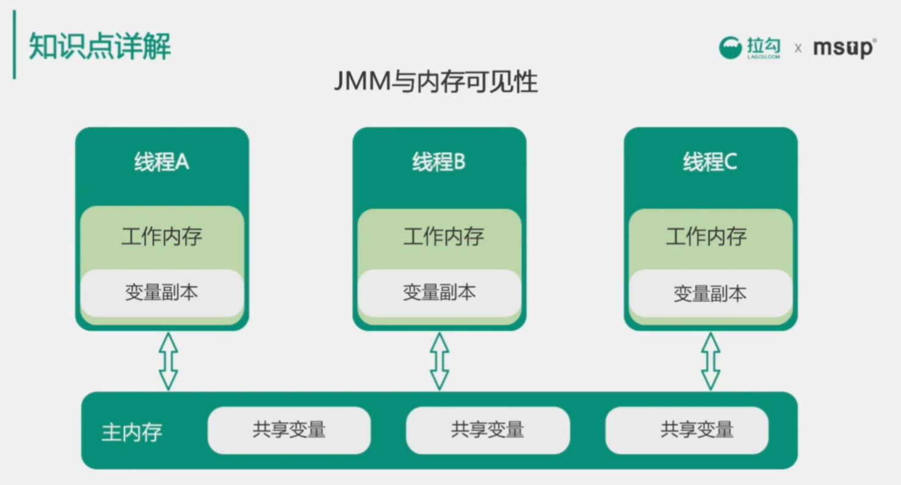
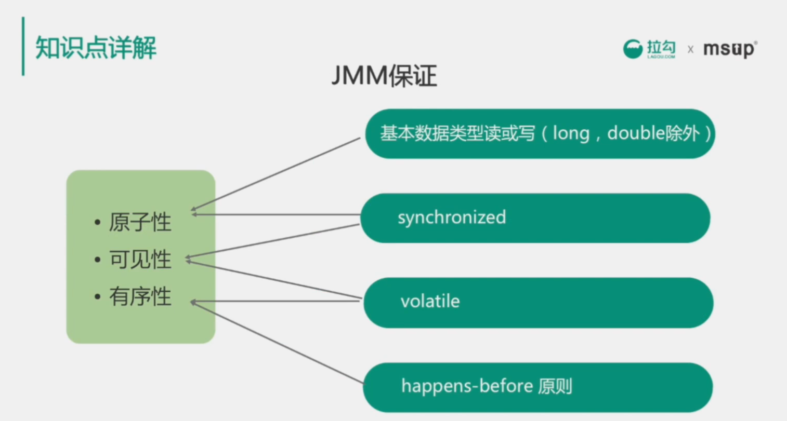
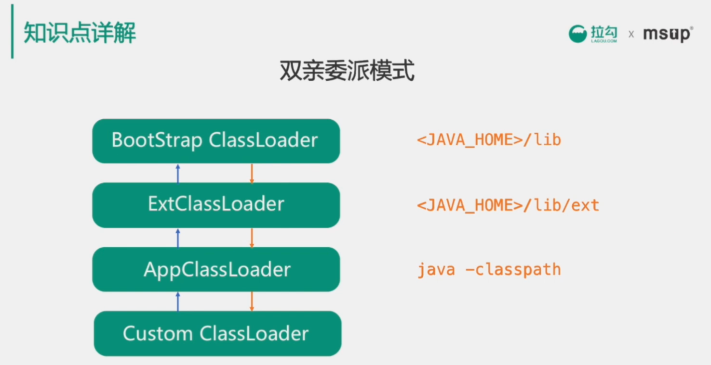
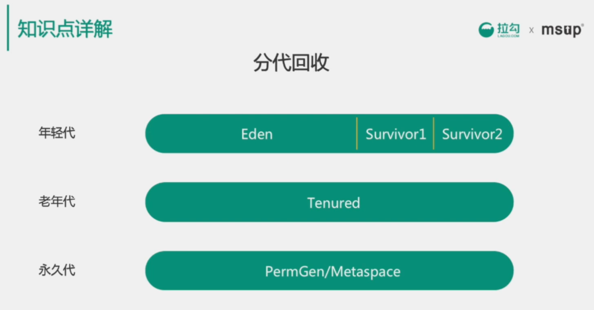
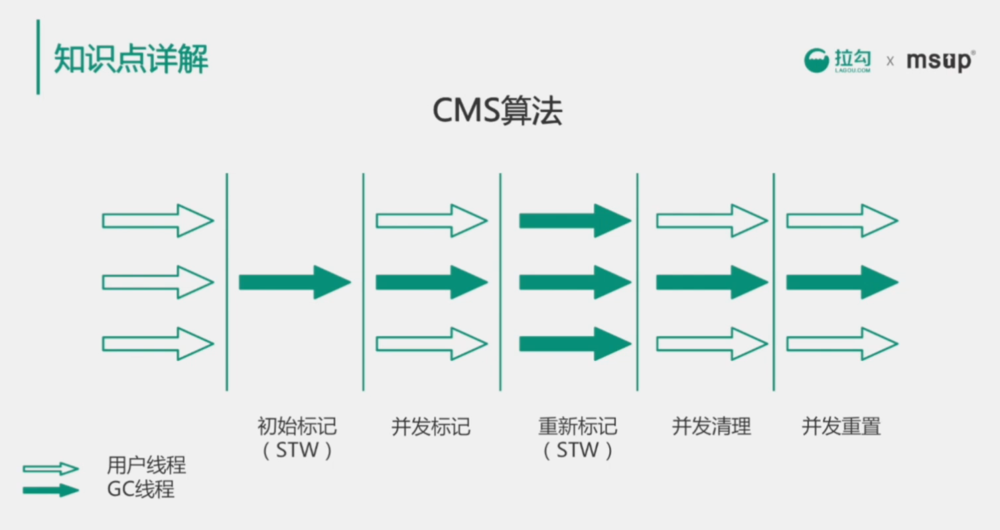
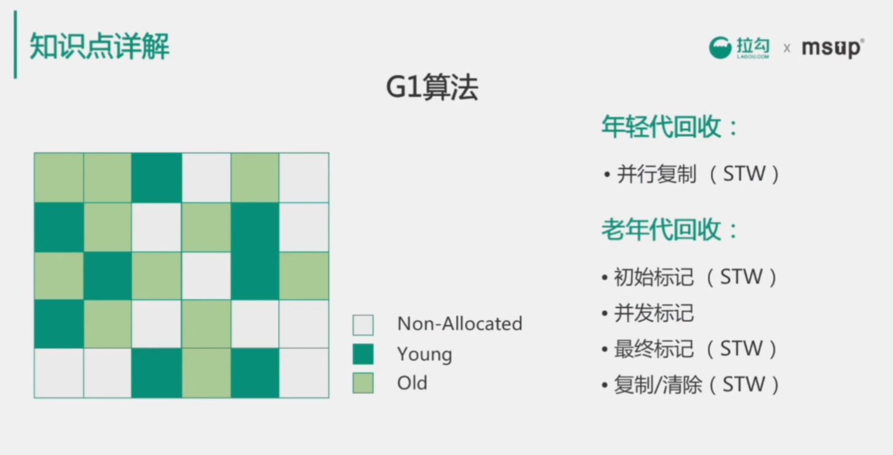
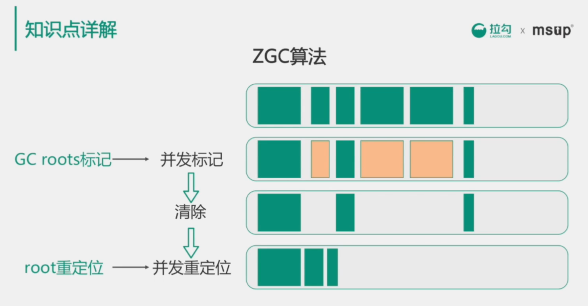

# 03 深入浅出JVM
* JVM内存模型
* java类加载机制
* 常用GC算法

## 1 知识点汇总
* 编译器优化 （偏重理论基础）
    1. 公共子表达式的消除
    1. 指令重排
    1. 内联
    1. 逃逸分析（方法逃逸、线程逃逸）
    1. 栈上分配
    1. 同步消除
* 类加载 （重点）
    1. 双亲委派机制
    1. Bootstrap类加载器
    1. Extension类加载器
    1. System类加载器
    1. 自定义类加载器
    > 要理解每个加载器的作用，分别记载哪些类型的类。
* GC （重点）
    1. 分代回收
        * 年轻代
        * 老年代
        * 持久代
    > 分代回收的思想和依据
    1. 回收期实现
        * 串行回收
        * 并行回收
        * CMS
        * G1
    > 不同垃圾回收算法的思路和适合的场景。
* 内存模型 （重点）
    1. 程序计数器
    1. 方法区
    1. 堆
    1. 栈
    1. 本地方法栈
    > 以上部分每个部分的作用，保存着哪些数据。
* 性能调优 （偏重实际应用，偏重实践能力）
    1. JVM参数
    > 常用JVM参数优化的作用，参数调优的依据。
    1. 性能分析工具
        * MAT
        * JMC
        * JStack
        * JStat
    > 了解分析工具能分析哪些类型的问题，使用的方法。
* 执行模式 （偏重理论基础）
    1. 解释模式
    1. 编译模式
    1. 混合模式
    > 理解以上三种模式的优缺点，了解java7提供的分层编译技术，JAT的即时编译技术和OSR站上替换，C1和C2编译器的应用场景

    > 新技术方便java10提供了Graal编译器
    > C1编译器，客户端编译器，C2编译器服务端编译器，C2优化更激进。

## 2 JVM内存模型
* 线程独占：栈、本地方法栈、程序计数器
* 线程共享：堆、方法区

> 执行java方法时使用栈，jvm会创建一个栈帧，调用方法时使用入栈，方法返回时执行出栈。

> 本地方法栈和栈类似，不用的是本地方法栈调用的是native原生的方法。

> 程序计数器保存在当前线程执行的字节码位置，每个线程工作时都有一个独立的计数器，只为执行java方法服务

> 堆被所有的线程共享，当堆内存没有可用的空间时，抛出OOM异常

> 方法区：用于存储被加载的类信息、常量、静态变量、即时编译器优化后的代码（java7中的PermGen（永久代）和java8中的Metaspace（元空间）都是永久代的实现）

> **面试重点**
>   1. 各部分的功能；
>   1. 哪些是线程共享，哪些是线程独享？

## 3 JMM和内存可见性
* JMM的主要目标是定义程序中变量的访问规则

> 由于指令重排序的问题，线程的写和读主内存的顺序可能会被打乱，因此JMM需要提供原子性、可见性、有序性的保证

> volatile 强制变量的赋值会刷新回主内存，强制变量的读取会从主内存中加载。不同的相乘可以看到变量的最新值。volatile和可以组织指令重排序。

## 4 java类加载机制
1. 加载（文件到内存）
1. 验证（文件格式、元数据、字节码、符号引用）
1. 准备（内变量内存）
1. 解析（引用解析、字段解析、接口解析、方法解析）
1. 初始化（静态块、静态变量）
1. 使用（实例化）
1. 卸载（GC）

> 准备阶段会为讲变量设置初始值，是0或null,不是代码中设置的具体值。不包括final修饰的变量。

> 只有用户自定义的类加载器加载的类才会被GC回收卸载，java提供的类加载器加载的类不会被卸载。

> 双亲委派机制的好处，避免类的重新加载，防止java核心类被篡改。

## 5 垃圾回收

**CMS算法**

> cms 算法是java1.7 以前最主流的回收算法。

> cms 使用标记清除算法，优点是并发收集，停顿小。

> 初始阶段的标记和重新标记会stop the world 

**G1算法**

> G1算法是java1.9之后的默认算法。

> G1的特点是保持高回收率的同时减少停顿。取消了堆中对年轻代和老年代的物理划分。每次只清理一部分，由此保证每次GC停顿时间不会过长。

> G1中是逻辑分代，不是物理分代。要清楚回收的过程和停顿的阶段。G1可以通过jvm参数设置region的大小（1-32M）。还可以设置最大的期望停顿时间。

**ZGC**

* java11中新出的算法（针对大内存堆得低延迟垃圾回收算法）（可以支持TB级别的堆）（非常高效 10ms以下的回收停顿时间）（基于64位系统）
* 着色指针
* 读屏障
* 并发处理
* 基于Region
* 内存压缩（整理）

## 6 面试考察点
* 深入理解JVM内存模型
* 了解类的加载机制
* 了解内存可见性
* 了解常用的GC算法和适用场景
* 能够根据业务场景选择合适的JVM参数和GC算法

## 7 加分项
* 编译器优化
* 问题排查经验和思路（解决线上经常FGC的问题，排查过内存泄露的问题）
* JVM调优经验和调优思路（针对高并发低延迟的场景如何调整GC参数，尽量降低停顿时间。针对队列处理机，如何尽可能提高吞吐率。）
* 了解最新的技术趋势（如ZGC、Graalvm）

## 8 真题
1. 简单描述以下JVM的内存模型
1. 什么情况下会触发FullGC？（年轻代晋升时，老年代空间不足。永久代空间不足。）
1. Java累的加载器有几种，关系是怎样的？
1. 双亲委派机制的加载流程是怎样的？有什么好处？
1. 1.8 问什么用Metaspace替换掉PermGen？Metaspace保存在哪里？
1. 编译期会对指令做哪些优化？（简单描述编译期的指令重排）
1. 简单描述一下volatile可以解决什么问题？如何做到？（强制主内存读写同步，防止指令重排序）
1. 简单描述下GC的分代回收
1. G1垃圾回收算法与CMS的区别有哪些？
1. 对象引用有哪几种方式，有什么特点？（强、弱、软，虚）
1. 使用过哪些JVM调试工具，主要分析哪些内容？（JMC中飞行记录器，堆分析工具MAT,线程分析工具Jstack,获取堆信息的Jmap）

