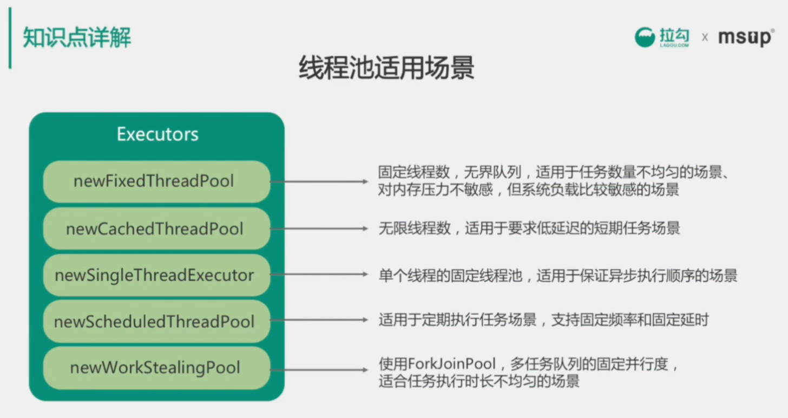

# 04 并发与多线程

* 线程的状态转换
* 线程的同步与互斥
* 线程池详解
* JUC重点工具实现

## 1 知识点汇总

### 死锁
* 产生死锁的四个基本条件
    1. 互斥
    1. 请求并持有
    1. 非剥夺
    1. 循环等待
* 竞争条件与临界区

* 死锁检测与防止

### 线程的通讯方式

* wait
* notify
* notifyAll

### java提供的机制

* ThreadLocal
* Fork/Join
* Volatile
* Interrupt

### 线程状态装换

* new 
* runnable
* blocked
* waiting
* timed_waiting
* terminated

### 同步与互斥

* synchronized
* lock
    1. 锁类型
    1. 锁实现
* cas
    1. unsafe
    1. 原语

### 常用工具类JUC

* ConcurrentXXX
* AtomicXXX
* Executor
* Caller&&Futrue
* Queue
* Locks

### 线程池
* 使用场景
* 原理与实现方式
* 线程池实现

## 2线程状态转换

* ABA 问题的解决办法
    1. java提供的JUC包中能解决该问题工具类
    1. 加时间戳或者标志位
    

\

## 3 面试考察点
* 理解线程的同步与互斥的原理
* 掌握线程安全相关机制
* 了解JUC工具的适用场景和实现原理
* 熟悉线程池的原理、使用场景、常用配置
* 理解线程的同步和异步、阻塞和非阻塞

## 4 加分项
* 结合实际项目经验和实际案例介绍原理
* 解决多线程问题的排查思路和经验
* 熟悉常用的线程分析工具和方法（利用jstack分析线程的运行状态）
* 了解java8 对JUC的增强
* 了解reactive异步编程思想

## 5 真题

1. 如何实现一个生产者和消费者模型？（锁、信号量、线程通信、阻塞队列）
1. 如何理解线程的同步与异步、阻塞和非阻塞？
1. 线程池处理任务的流程是怎样的？
1. wait和sleep有什么不同？
    > wait 属于Object，会释放对象锁，必须在同步代码块中使用，不需要捕获异常。

    > sleep 属于Thread，不会释放对象锁，可以在任何地方使用，需要捕获异常。
1. Synchronized和reentrantLock有什么不同？各适合什么场景？
1. 读写锁适用于什么场景？ ReentrantReadWriteLock是如何实现的？
    > 读写锁比较适用于读并发多，写并发少的场景。

1. 线程之间如何通信？
1. 保证线程安全的方法有哪些？
1. 如何尽可能提高多线程并发性能？
    > 尽量减少临界区范围，使用ThreadLocal,减少线程切换，使用读写锁或者CopyOnWrite机制。
1. ThreadLocal用来解决什么问题？ThreadLocal是如何实现的？
    > 解决线程数据隔离的问题。
1. 死锁的产生条件？如何分析是否有死锁？
1. 在实际工作中遇到过什么样的并发问题，如何发现（排查）并解决的？

